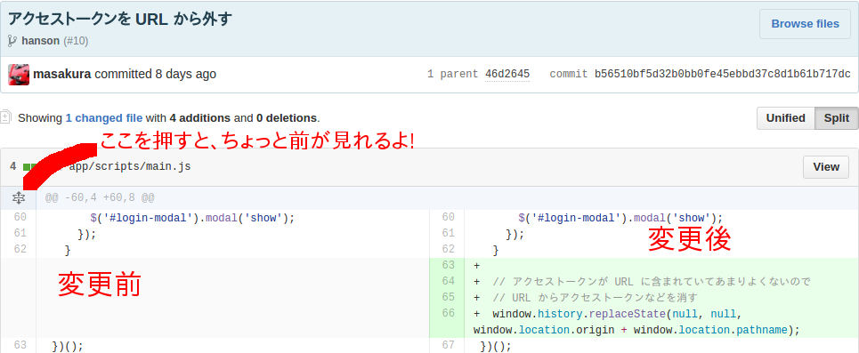

# ハンズオン (案)
## ハンズオンの目的
* OAuth2 認証の仕組みを覚える
* RESTful API を呼び出したアプリの作り方を覚える

本ハンズオンでは、WordPress.com REST API を利用して、投稿の一覧を取得するだけの簡単なアプリを作ります。


## 本ハンズオンを行うにあたっての注意
本ハンズオンを円滑に行うために以下のことにご注意ください。


### 準備はできていますか?
* パソコンはインターネットにつながっていますか?
* [Google Chrome](https://www.google.co.jp/chrome/browser/) がインストールされていますか?
* [GitHub](https://github.com/) アカウントは作成済みですか?
* [WordPress.com](https://wordpress.com/) アカウントは作成済みですか?
  - ブログを開設して投稿がいくつかありますか?


### うまく行かないときは手を挙げてお知らせください!
講師の側からは、うまく進んでいるのかどうかが分かりません。うまく行かない時は手を挙げてお知らせください!


### コピペしてください!
コピペ推奨です。できれば写経をして、一行ずつ何が行われているのか理解していただけると大変嬉しいのですが、ハンズオンでは時間が限られています。なるべくコピペをして円滑に進むようご協力をお願いいたします。

ハンズオンの教材は何度もやり直せますので、まずはコピペで流れを掴んでから、復習で写経をするのをおすすめします!


### どこにコピペするかに注意してください!
`何行目の直後に以下のコードを追加します`と書かれていますが、何度もコードを追加する中でちょっとずつ行番号がずれていきます。`差分`リンクを用意していますので、リンク先でどこにコードを挿入するかを確認してください。



[差分](https://github.com/masakura/wordpresscom-subscribe/commit/b56510bf5d32b0bb0fe45ebbd37c8d1b61b717dc)でちょこっと触ってみよう!

### インデントに注意!
コピペの際にインデントに注意してください。

```javascript
    console.log('abc');
  });
})();
```

このコードに、`console.log('def');` を追加する際に以下のようにしてしまうと、全体の形のイメージが変わってしまい、その後どこにコードをコピペしたらいいのかわからなくなります。

```javascrript
    console.log('abc');

    // 追加された行
    console.log('def');  });
})();
```

以下が正しい例です。

```javascrript
    console.log('abc');

    // 追加された行
    console.log('def');
  });
})();
```


### `main.js`のみ修正します!
今回のハンズオンでは HTML ファイルや CSS ファイルは修正しません。予めこちらで用意してあります。


### 本番コードではありません!
今回のコードはハンズオン用に作られたものです。本番にそのまま流用できるものではございません。

* `console.log` を多用していますが、本番用のコードでは使用を避けてください
* 脆弱性を生む可能性があるコードが含まれています


## 今回使用するライブラリ
今回のハンズオンでは、CSS/JavaScript のフレームワークやライブラリを使用しています。

| 名前 | 説明
| ---- | ----
| [jQuery](https://jquery.com/) | 使われていない事のほうが珍しいライブラリ。今回は WordPrss.com API の呼び出しや、WordPress.com 投稿の表示に利用しています。
| [Bootstrap](http://getbootstrap.com/) | 見た目を一からデザインするのは大変時間がかかりますので、今回は Bootstrap というフレームワークを利用した上で見た目を調整しております。
| [Underscore.js](http://underscorejs.org/) | 今回は投稿を表示する HTML を生成するためのテンプレートエンジンとして利用しています。オブジェクトや配列の操作が得意ですので、おすすめです。
| [Moment.js](http://momentjs.com/) | 今回は投稿の日時を好みの形に表示するために利用しています。


#### REST API の練習
WordPress.com REST API は [WordPress.com Developer Console](https://developer.wordpress.com/docs/api/console/) というものが用意されていて、簡単に REST API を実行し結果を見ることができます。

まずはこれで REST API 呼び出しの雰囲気を確かめましょう!

1. `posts` にある `GET /v1.1/sites/$site/posts/` を探し、クリックします
2. `$site` のところに、作成した WordPress.com ブログのドメイン名を入力してください (Ex: `masakura.wordpress.com`)
3. 右上の実行ボタンをクリックすると結果が取得できます


## ハンズオン


### 準備
#### 雛形 Plunk のフォーク
今回のハンズオン用に教材の雛形を用意してありますので、そちらをフォークして使います。

1. [Plunker](https://plnkr.co/) にアクセスし、右上の `Sign in with Github` ボタンをクリックします
  * GitHub でログインします
  * `Authorize application` で Plunker に許可を与えます
2. [教材の雛形 plunk](https://plnkr.co/edit/cbsmCG?p=info) にアクセスします
3. `Fork` ボタンをクリックしてフォークします
4. 右上の自分のアカウントのボタンから `My plunks` をクリックします
5. フォークした Plunk の上にマウスカーソルを合わせて `View this Plunk an overlay  (再生ボタン)` をクリックします
6. `Fullscreen` ボタンをクリックします
  * 新しく開いたウインドウはそのままにしてください!
  * この URL がアプリの URL になりますのでメモしてください!
7. `Edit` ボタンをクリックします
8. `index.html` ファイル内の 22 行目の `My Postlist` を適当に書き換えて、`Save` ボタンをクリックします
9. 6 のウインドウでリロードボタンをクリックし、内容が反映されていることを確認してください

Plunker はプレビュー機能があり、変更をその場で確認することができますが、今回は OAuth2 のからみでちょっと手順が複雑になっています。ごめんなさい...


#### WordPress.com アプリの登録
アプリを作る前に WordPress.com REST API を使うためのアプリの登録が必要となります。

1. [Create an application](https://developer.wordpress.com/apps/new/) にアクセス
2. Name/Description は適当に入力
3. Website URL/Redirect URL/Javascript Origins にはアプリの URL を追加する
  * `https://run.plnkr.co/plunks/xxxxxx/`
4. Whats is ...? に答えを入れる
5. Type は `Web` を選択
6. `Create` ボタンをクリック
7. `Client ID` などが表示される
  * `Client ID` は後で使いますのでメモをしてください!


### ハンズオン
準備が完了しましたのでハンズオンを進めていきます。


#### 認証し、アクセストークンをもらうところまで
WordPress.com の機能を呼び出すまでの流れはこんな感じ。

1. アプリサイトにアクセスする
2. WordPress.com の OAuth2 サイトにリダイレクトする
3. WordPress.com のサイトでログインをする
4. WordPress.com のサイトで API を利用する認可をもらう
5. アプリサイトに転送される
  - この時、アクセストークンが URL に追加される

手順はこんな感じ。

1. JavaScript をコピペします
2. 13 行目の `ここに書いてださい` を消して、Client ID を書いて、保存します
  - `var client Id = 000000;` のような感じ
3. アプリをリロードすると、ダイアログが表示されますので `WordPress.com でログインする`をクリックします
  - 以後、保存するやリロードする手順は省略します
4. 動き始めて WordPress.com へ飛ばされます
  - ログインし、`Approve` ボタンをクリックしてください
5. 戻ってくるので、URL にアクセストークンが含まれていることを確認します

[差分](https://github.com/masakura/wordpresscom-subscribe/commit/aa09d757fa902019812385cf5dcc03bdb245b124)

```javascript
(function () {
  'use strict';

  // WordPress.com からアプリのキーを取得し、ここに書いてください
  // 1. https://developer.wordpress.com/apps/new/ にアクセス
  // 2. Name/Description は適当に入力
  // 3. Website URL/Redirect URL/Javascript Origins にはアプリの URL を追加する
  //   - Plunker のアプリの URL
  // 4. Whats is ...? に答えを入れる
  // 5. Type は `Web` を選択
  // 6. `Create` ボタンをクリック
  // 7. `Client ID` などが表示される
  var clientId = ここに書いてください; // あなたの Client ID を書いてください

  // アクセストークンなどを格納しておくための変数
  var params = {};

  // ダイアログのログインボタンがクリックされたら WordPress.com でログインさせる
  // 1. `WordPress.com でログインする` をクリックする
  // 2. WordPress.com のサイトが表示されるので、ログインし、`Approve` ボタンをクリックする
  // 3. ページに戻ってくるので、URL にアクセストークンがあることを確認する
  $(document).on('click', '#login', function () {
    // 現在の URL をリダイレクト先に設定する
    // http://localhost:9000 とか
    var redirect = window.location.origin + window.location.pathname;
    var location = 'https://public-api.wordpress.com/oauth2/authorize?client_id=' + clientId + '&redirect_uri=' + redirect + '&response_type=token';
    window.location = location;
  });

  // アクセストークンがまだないときはログインボタンを持っているダイアログを表示します
  if (!params['access_token']) { // eslint-disable-line dot-notation
    $(document).ready(function () {
      $('#login-modal').modal('show');
    });
  }
  })();
```


#### アクセストークンを URL から取得する
URL を分解してアクセストークンを取得します。

1. 28 行目の直後に以下のコードを挿入してください
2. 開発者ツールのコンソールにアクセストークンが表示されていることを確認します

[差分](https://github.com/masakura/wordpresscom-subscribe/commit/46d26459818fb337735c0dcb64dd31201398cdc7)

```javascript

  // アクセストークンを取得
  // OAuth2 で認証とアクセス許可の取得が終わったら、戻ってくる
  // その際、http://localhost:9000/#access_token=...&token_type=bear...
  // のように URL にアクセストークンが埋め込まれている
  // この URL の # 以降の部分を分解して、以下のような形に変換している
  // {
  //   'access_token': '...',
  //   'token_type': 'bear',
  //   ...
  // }
  // # 以降を & で分割
  var hash = window.location.hash;
  if (hash) {
    hash.substring(1).split('&')
      .forEach(function (p) {
        // p に access_token=... などが入っている

        // access_token と ... に分割する
        var pair = p.split('=', 2);

        // 値の部分 ... を URI デコードする
        // %40 -> @ のように変換する
        params[pair[0]] = decodeURIComponent(pair[1]);
      });
  }
  console.log(params);
```


#### アクセストークンを URL から除去する
このままだとアクセストークンが表示されっぱなしになるので、消します

1. 62 行目の直後に以下のコードを追加します
2. URL を確認したら、アクセストークンが消えています

[差分](https://github.com/masakura/wordpresscom-subscribe/commit/b56510bf5d32b0bb0fe45ebbd37c8d1b61b717dc)

```javascript

  // アクセストークンが URL に含まれていてあまりよくないので
  // URL からアクセストークンなどを消す  window.history.replaceState(null, null, window.location.origin + window.location.pathname);
```


#### 入力されたサイトを取得する
プログラムを組むときの鉄則はちょっとずつです。一気に作りたいところですが、ぐっとこらえて、テキストボックスに入力されたサイトが正しいかをまずは確認します。

1. 66 行目の直後に以下のコードを追加します
2. 再度 WordPress.com に飛ばされますので、`Approve` ボタンをクリックします
3. テキストボックスにサイト名 (自分で作った WordPress.com サイト、`masakura.wordpress.com` とか) を入れ、`購読`ボタンをクリックします。
4. コンソールにサイト名が表示されます

[差分](https://github.com/masakura/wordpresscom-subscribe/commit/ddc146571ebbaa8d2353f34560b5a4bd16d22920)

```javascript

  // 投稿フォームが投稿されたら...
  $(document).on('submit', '#subscribe', function (e) {
    // 標準のフォームの投稿機能をキャンセルする
    // これを行わないと、サーバーに再度アクセスしてしまう
    e.preventDefault();

    // 入力されたサイトを取得する
    var site = $('#site_id').val();

    // サイトが取得されているかどうかをデバッグする
    console.log('site => ' + site);
  });
```


#### WordPress.com 投稿を取得する
ここが一番の山場です!

WordPress.com REST API を利用して、投稿を取得します。jQuery の `$.ajax` 関数で呼び出せますが、アクセストークンを渡してやらなければいけません。

1. 78 行目の直後に以下のコードを追加します
2. WordPress.com にリダイレクトされるので、`Approve` ボタンをクリックします
3. テキストボックスにサイトを入力し、`購読`ボタンをクリックします
4. 購読内容はコンソールに出力されます
  - エラーなどないか確認してください

[差分](https://github.com/masakura/wordpresscom-subscribe/commit/b320edf930852ceb771d24363b87ec1ac274fce2)

```javascript

    // サイトが取得されているかどうかをデバッグする
    console.log('site => ' + site);

    // WordPress.com API を呼び出して投稿一覧を取得する
    $.ajax({
      url: 'https://public-api.wordpress.com/rest/v1/sites/' + site + '/posts/',
      type: 'GET',
      beforeSend: function (xhr) {
        // 呼び出しの際、認証情報を付与する
        xhr.setRequestHeader('Authorization', 'BEARER ' + params['access_token']); // eslint-disable-line dot-notation
      }
    })
      .then(function (data) {
        console.log(data);
      })
      .fail(function (error) {
        console.log(error);
      });
```


#### 結果から投稿のみを取り出す
WordPress REST API の呼び出し結果はこんな感じになってます。

```javascript
{
  found: 39
  posts: [
    {
      ID: 1234
      url: 'http://...',
      // ...
      title: 'たいとる',
      // ...
    }, {
      // ...
    },
    // ...
  ]
}
```

これから、投稿のみを取り出します。

1. 90 行目の直後に以下のコードを追加します
2. WordPress.com にリダイレクトされるので、`Approve` ボタンをくりくします
3. テキストボックスにサイトを入力し、`購読`ボタンをクリックします
4. 投稿はコンソールに出力されます

[差分](https://github.com/masakura/wordpresscom-subscribe/commit/91119fb54364bf0cfb3d099cda7eed536faee1fc)

```javascript

        // 呼び出しの結果から、投稿の一覧を取得します
        var posts = data.posts;
        console.log(posts);
```

こんな感じになるはずです。

```javascript
[
  {
    ID: 1234
    url: 'http://...',
    // ...
    title: 'たいとる',
    // ...
  }, {
    // ...
  },
  // ...
]
```


#### 投稿をひとつずつ処理する
投稿をひとつずつ、画面に表示できるように変換していきます。ですが、一気にやると大変なので、まずは投稿をひとつずつ表示してみましょう。

1. 94 行目の直後に以下のコードを追加します
2. WordPress.com にリダイレクトされるので、`Approve` ボタンをくりくします
3. テキストボックスにサイトを入力し、`購読`ボタンをクリックします
4. 投稿がひとつずつコンソールに出力されます

[差分](https://github.com/masakura/wordpresscom-subscribe/commit/22bfa7bcae70e4789db2761d34ed066353eaace5)

```javascript

        // 投稿データをひとつずつ、リストに変換していきます
        var $posts = posts.map(function (post) {
          console.log(post);
        });
```

こんなのがたくさん表示されます。


```javascript
{
  ID: 1234
  url: 'http://...',
  // ...
  title: 'たいとる',
  // ...
}
```


#### 投稿を表示しやすいように加工する
投稿をそのまま表示しようとすると、面倒な問題がおきます。

* 日付が `2016/02/13T12:34:45` と表示されたり...
* 写真がない投稿にダミーの写真を入れられなかったり...

なので、一度、必要な情報だけに絞って、加工しておくと便利です。

1. 98 行目の直後に以下のコードを追加します
2. WordPress.com にリダイレクトされるので、`Approve` ボタンをくりくします
3. テキストボックスにサイトを入力し、`購読`ボタンをクリックします
4. 投稿はコンソールに出力されます

[差分](https://github.com/masakura/wordpresscom-subscribe/commit/dd6853c9064af5b0523cbb5dfaffc458aa04559f)

```javascript

          // 表示に適した形式に変換する
          var item = {
            title: post.title,
            date: moment(post.date).format('YYYY.MM.DD'),
            url: post.URL,
            thumbnail: post.featured_image
          };
          // 画像がない場合は代わりの画像を表示
          if (!item.thumbnail) {
            item.thumbnail = 'http://placehold.it/200x150/27709b/ffffff?text=No Photo';
          }
          console.log(item);
```

こんな感じになるはずです。

```javascript
{
  date: '2016.02.13',
  thumbnail: 'http://...'
  title: 'たいとる',
  url: 'http://...'
}
```


#### 投稿一つを HTML に変換します
画面に表示するためには HTML に変換しなければなりません。変換をするときは、テンプレートエンジンを使うと良いです。今回は Underscore.js のテンプレートエンジンを使っています。

`app/index.html` 内の 64 行目当たりがテンプレートです。`<%- url %>` と書かれているところが `url` と置き換えられます。

```html
    <script id="post-template" type="text/template">
      <li class="post-group-item col-xs-12 col-sm-12 col-md-4">
        <a href="<%- url %>" target="_blank">
          <div class="postimg">" alt="<%- title %>"></div>
          <p class="postitle">
            <span class="postdate"><%- date %></span>
            <%- title %>
          </p>
          <div class="postbtn">続きを読む</div>
        </a>
      </li>
    </script>
```

1. 11 行目の直後に以下のコードを追加します
2. WordPress.com にリダイレクトされるので、`Approve` ボタンをくりくします
3. テキストボックスにサイトを入力し、`購読`ボタンをクリックします
4. HTML はコンソールに出力されます (実際は jQuery Object)

[差分](https://github.com/masakura/wordpresscom-subscribe/commit/337b0e4c5e48a8e78f803c5f69aa9afd6644d4ac)

```javascript

          // テンプレートを取得して、html に変換します
          var template = _.template($('#post-template').html());
          var $html = $(template(item));
          console.log($html);
```

##### 脆弱性について
* `<%= %>` を使うとかなり危ないです
  - 第三者が書いた JavaScript が動作してしまいます
* `<%- %>` でも今回のように `<a href="<%- url %>">` などで使うと危ないです
  - `http://` や `https://` で始まるかどうかを検証する必要があります
* 今回はハンズオンなのできちんとした対処はしてませんが、アプリをきちんと作るときは注意してください


#### HTML を返すようにする
投稿を HTML に変換しましたので、それを返します。

1. 116 行目の直後に以下のコードを追加します
2. WordPress.com にリダイレクトされるので、`Approve` ボタンをくりくします
3. テキストボックスにサイトを入力し、`購読`ボタンをクリックします
4. 今回はなにも変わりません

[差分](https://github.com/masakura/wordpresscom-subscribe/commit/c1660b56eb94caab109348c81c07cb3f85a7e350)

```javascript

          // html を返します
          return $html;
```

#### すべての投稿の HTML を取得できたか確認する
ここまでで、すべての投稿を HTML に変換できたはずなので、それを確認します。

1. 120 行目の直後に以下のコードを追加します
2. WordPress.com にリダイレクトされるので、`Approve` ボタンをくりくします
3. テキストボックスにサイトを入力し、`購読`ボタンをクリックします
4. 投稿はコンソールに出力されます

[差分](https://github.com/masakura/wordpresscom-subscribe/commit/5427bba31e1ad7784851e818e5ff7e41ca8c8fbf)

```javascript
        console.log($posts);
```


#### すべての投稿の HTML を表示します
ここまでで、投稿を表示する準備は整いました。あとは、画面に表示できるよう、追加するだけです!

1. 121 行目の直後に以下のコードを追加します
2. WordPress.com にリダイレクトされるので、`Approve` ボタンをくりくします
3. テキストボックスにサイトを入力し、`購読`ボタンをクリックします
4. できました!

[差分](https://github.com/masakura/wordpresscom-subscribe/commit/5facf48eb2339d91f6e28ea971a7e3b68beab0f3)

```javascript

        // <ul id="#posts"> を空にして、投稿データを追加しなおします
        $('#posts').empty().append($posts);
```


## 余裕な方へ...
これくらい余裕だという方は、ぜひ自分なりのアプリを作ってみてください!

* 自由な発想でなにか作ってみましょう! ブログ投稿アプリも作れます!
* 認証なしで投稿を表示できるようにしてみましょう!
  - AWS Gateway + Lambda を使えばいけますが、規約違反っぽいです...
  - RESTfull API ではありませんが、RSS 使えばいけそう?


## まとめ
いかがだったでしょうか? なんとなく流れはつかめたと思います。SNS 系でアプリを作る場合の基礎となりますので、理解できるまで何度か繰り返してみてください!
